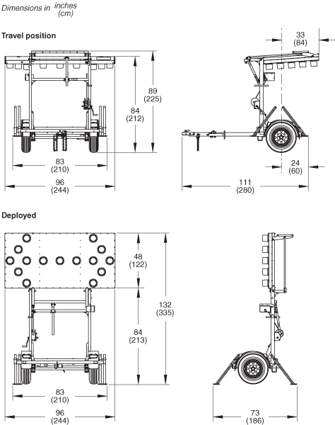

#  README

This is a simple iOS App that mimics an "arrow board", one of those portable highway road warning signs 
you sometimes see on the highway.

Believe it or not, there is a bonafided standard for these things:
* https://mutcd.fhwa.dot.gov/htm/2003r1r2/part6/fig6f-06_longdesc.htm.

## Dimensions

Based in part on WANCO products.
* See: https://www.wanco.com/product/weco-folding-frame-arrow-boards/
* Dimensions (basically 1:2)
   
* Some standard patterns
  

